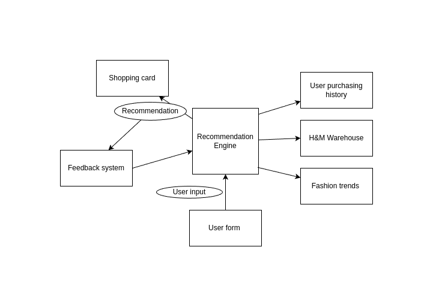
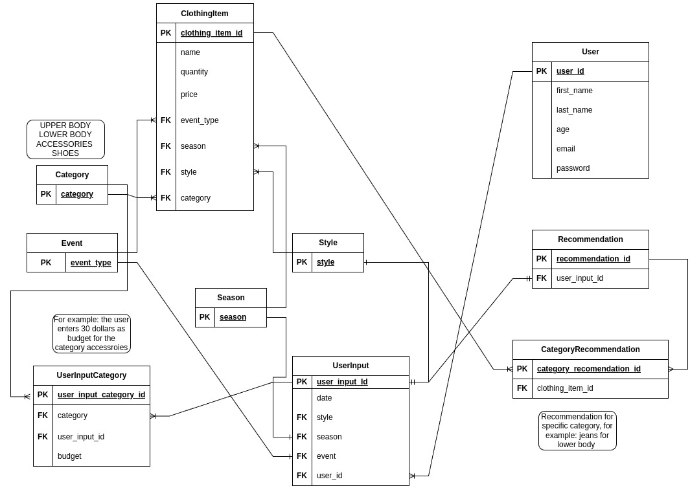

# H&M Clothes Recommendation Engine System

## Architecture 

The architecture consists of a system that takes user input regarding the characteristics of the clothes that the user wants to have recommended and, as a result, provides a recommendation, which is then automatically added to the user's shopping list. The user can also rate the recommendation. To provide good recommendations, the system takes into account the user's previous purchasing history, searches the entire H&M purchasing database for matches based on demographics, and also searches some external sources of information regarding current fashion trends. The user can then rate the recommendation, which will further improve the recommendation engine.

Customers are often undecided about which clothes to buy or do not want to spend a lot of time finding a matching combination. The recommendation engine would enable them to reduce their decision time and help them with their choice. By adding the recommendation directly to the shopping cart, this software will facilitate the shopping process for the user.



## Software implementation

The software implementation consists of a single endpoint called the `/recommendations` POST method. As an input, it takes user requirements regarding the desired recommendation:
* Style(could be: formal, casual, streetwear, athleisure)
* Event(could be: wedding, birthday, gala, etc.)
* Season(summer, autumn, winter, spring)
* The user also specifies budget for each category(there are 4 categories: upper body, lower body, shoes, accessories.

As an output, the user receives a single recommendation, that for each category fulfills the criterion. If there is not a single clothing item that fulfills the criterion, then a recommendation for the given category is not provided.



## Endpoints

There is a single endpoint in the application, `/recommendations` `POST` method. You can access the OpenAPI

http://localhost:8080/swagger-ui/index.html


The requests:
```
{
  "style": "FORMAL",
  "season": "WINTER",
  "event": "WEDDING",
  "userInputCategories": [
    {
      "category": "UPPER_BODY",
      "budgetInEuros": 60
    },
    {
      "category": "LOWER_BODY",
      "budgetInEuros": 80
    },
    {
      "category": "ACCESSORIES",
      "budgetInEuros": 50
    },
    {
      "category": "SHOES",
      "budgetInEuros": 120
    }
  ]
}
```

And then part of the response:
```
 "recommendations": [
    {
      "id": 1266145483,
      "clothingItem": {
        "id": 5,
        "name": "Dress Shirt",
        "quantity": 8,
        "price": 39.99,
        "events": [
          "WEDDING",
          "GALA"
        ],
        "seasons": [
          "WINTER",
          "SPRING"
        ],
        "styles": [
          "FORMAL"
        ],
        "category": "UPPER_BODY"
      }
    },
    {
      "id": 1051816331,
      "clothingItem": {
        "id": 27,
        "name": "Tie",
        "quantity": 30,
        "price": 49.99,
        "events": [
          "WEDDING"
        ],
        "seasons": [
          "SPRING",
          "AUTUMN",
          "WINTER"
        ],
        "styles": [
          "FORMAL"
        ],
        "category": "ACCESSORIES"
      }
    },
    {
      "id": 723334691,
      "clothingItem": {
        "id": 26,
        "name": "Oxford shoes",
        "quantity": 30,
        "price": 19.99,
        "events": [
          "WEDDING",
          "CLUBBING"
        ],
        "seasons": [
          "WINTER"
        ],
        "styles": [
          "FORMAL"
        ],
        "category": "SHOES"
      }
    },
    {
      "id": 1767679807,
      "clothingItem": {
        "id": 28,
        "name": "Trousers",
        "quantity": 2,
        "price": 79.99,
        "events": [
          "WEDDING"
        ],
        "seasons": [
          "SPRING",
          "AUTUMN",
          "WINTER"
        ],
        "styles": [
          "FORMAL"
        ],
        "category": "LOWER_BODY"
      }
    }
  ]

```

## Technologies used 
* Java 21 
* Spring Boot 3.3
* Maven
* OpenAPI 2.5.0

## Main improvement points
* Adding validation to user request input
* Adding testing
* Instead of randomly choosing from the items that fulfill the criteria, in a real world example a good algorithm has to be designed, possibly with ML usage.